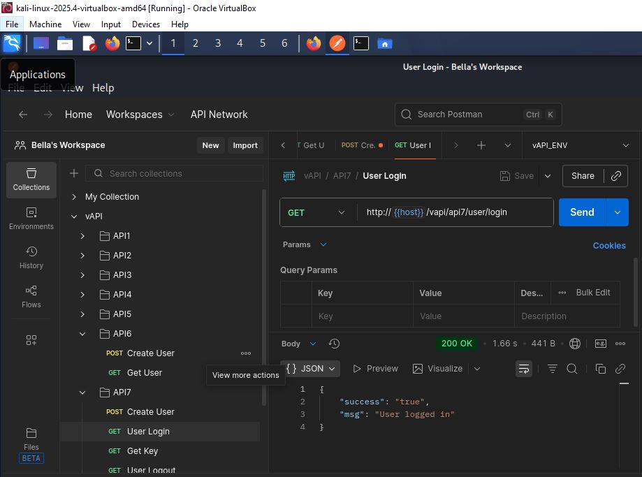
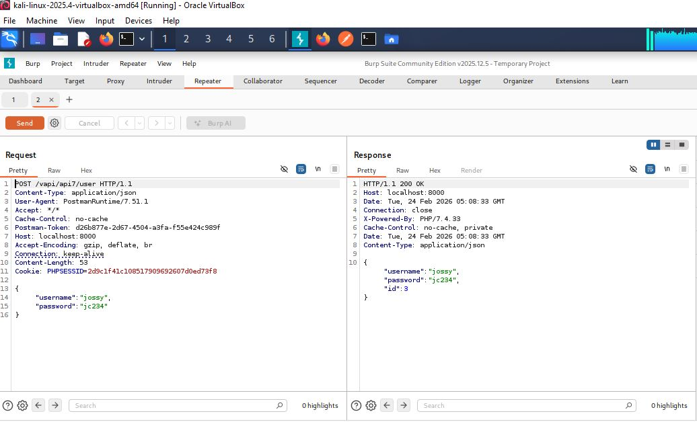
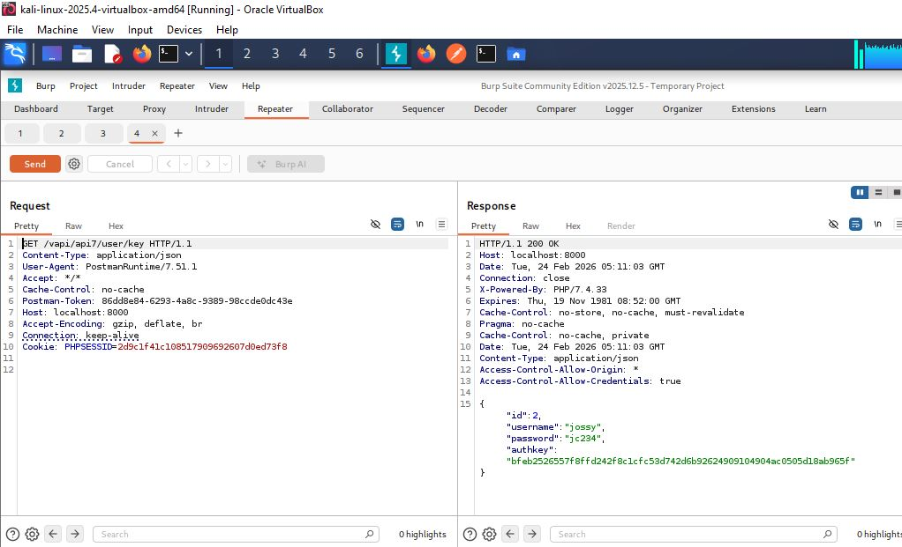
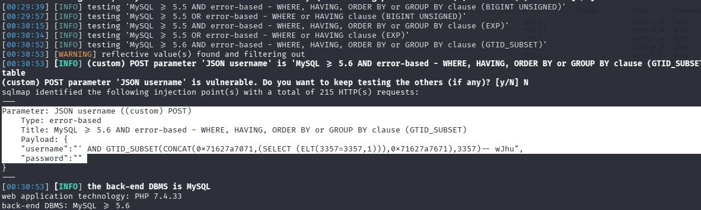
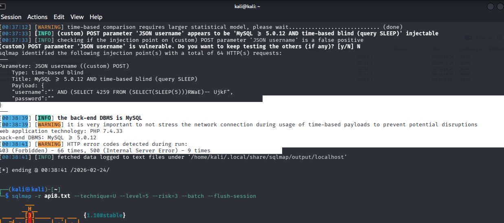
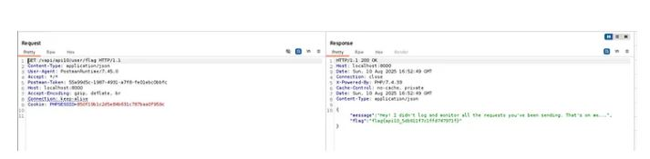
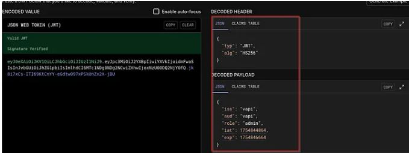

    API Security Assessment Case Study — vAPI Endpoints 6–10

  Objective
The objective of this project was to perform security testing against a vulnerable API environment and identify potential vulnerabilities across multiple endpoints based on the OWASP API Security Top 10.
Testing was conducted in a controlled lab environment designed for educational purposes.

  Scope
The assessment focused on API endpoints 6 to 10 within the vAPI application.
The goal was to analyze request handling, authentication controls, authorization logic, and data exposure risks.

  Tools Used
Burp Suite
Postman
Web Browser Developer Tools

  Methodology
The following approach was used during testing:
  1.Intercept API traffic using Burp Suite proxy.
  2.Identify endpoints, parameters, and request structures.
  3.Analyze authentication and authorization mechanisms.
  4.Manipulate requests to test access controls.
  5. Observe server responses for unintended behavior.
  6.Document findings and potential security risks.

  Vulnerabilities Explored
During testing, multiple security weaknesses were analyzed, including:
  Authorization weaknesses (BOLA / IDOR concepts)
  Input manipulation opportunities
  Data exposure scenarios
  Endpoint behavior inconsistencies
  (Some endpoints demonstrated insecure handling of user-controlled parameters which could lead to unauthorized access if implemented in production systems.)
   
  Example Exploitation Scenario
One endpoint allowed modification of request parameters associated with user-specific resources.
By altering identifiers within intercepted requests, it was possible to observe responses that indicated insufficient authorization validation.
This demonstrates how attackers may attempt to access or manipulate data belonging to other users when proper access controls are not enforced.
   
  Impact
If present in a real-world production environment, such weaknesses could lead to:
  Unauthorized data access
  Account data exposure
  Privilege escalation
  Loss of user trust
  Regulatory and compliance risks
   
  Remediation Recommendations
1.Implement strict server-side authorization checks.
2.Validate user permissions for every object request.
3.Avoid relying on client-controlled identifiers.
4.Implement proper input validation.
5.Apply logging and monitoring for suspicious activity.
   
  Key Learning Outcomes
This project improved my understanding of:
1.API reconnaissance techniques
2.Request interception and manipulation
3.Authorization testing strategies
4.Identifying insecure API behavior
5.Security documentation practices
It also strengthened my hands-on experience using Burp Suite and Postman for API security testing.

    Screenshots
Screenshots demonstrating intercepted requests, modified parameters, and responses are included in the /screenshots directory.
##  Screenshots

### Create User Request in Postman- API 6-MASS ASSIGNMENT

### Get User Request in Postmant- API 6-MASS ASSIGNMENT

### Get User Login Request in Postman- API7 – Security Misconfiguration (CORS)
 

###Create User Request in Postman- API7 – Security Misconfiguration (CORS)

### Create User Request in Burpsuiten- API7 – Security Misconfiguration (CORS)

### Get User Login Request in Burpsuite- API7 – Security Misconfiguration (CORS)

### Get User Key Request in Burpsuite- API7 – Security Misconfiguration (CORS)

### sqlmap to automate testing in Burpsuite- API 8-SQL Injection

### Error based SQL Injection API 8 SQL Injection

### Time based SQL Injection API 8 SQL Injection

### Union SQL Injection API 8 SQL Injection

### Exposed SQL DATABASE- API 8 SQL Injection

### Exposed ogin credentials- API 8 SQL Injection

### Successfully logged in and access protected resources using Burpsuite - API 8 SQL Injection

### Rate limiting testing (v1 endpoint) on Burpsuite - API9 – Improper Asset Management

### Rate limiting testing (v2 endpoint) on Burpsuite - API9 – Improper Asset Management

### Brute-force attack against /v1 on Burpsuite - API9 – Improper Asset Management

### API returning a confirmation that logging was not implemented on Burpsuitte - API10 – Lack of Logging and Monitoring

### create User Request on Postman- API10 – Lack of Logging and Monitoring

### Rate limiting testing (v1 endpoint) on Burpsuite - API10 – Lack of Logging and Monitoring

### Exposed Token on Burpsuite - API10 – Lack of Logging and Monitoring

